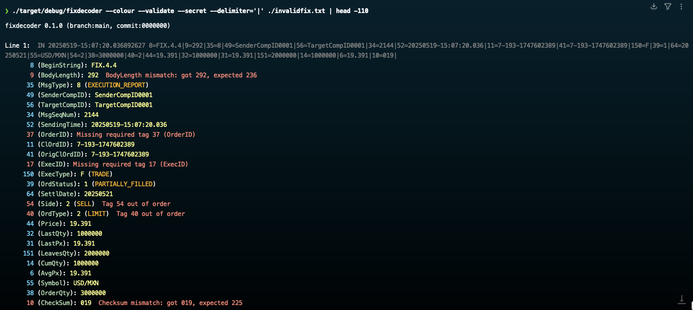

---

[](https://sonarcloud.io/summary/new_code?id=stephenlclarke_fixdecoder_java)
[](https://sonarcloud.io/summary/new_code?id=stephenlclarke_fixdecoder_java)
[](https://sonarcloud.io/summary/new_code?id=stephenlclarke_fixdecoder_java)
[](https://sonarcloud.io/summary/new_code?id=stephenlclarke_fixdecoder_java)
[](https://sonarcloud.io/summary/new_code?id=stephenlclarke_fixdecoder_java)
[](https://sonarcloud.io/summary/new_code?id=stephenlclarke_fixdecoder_java)
[](https://sonarcloud.io/summary/new_code?id=stephenlclarke_fixdecoder_java)
[](https://sonarcloud.io/summary/new_code?id=stephenlclarke_fixdecoder_java)
[](https://sonarcloud.io/summary/new_code?id=stephenlclarke_fixdecoder_java)
[](https://sonarcloud.io/summary/new_code?id=stephenlclarke_fixdecoder_java)
[](https://sonarcloud.io/summary/new_code?id=stephenlclarke_fixdecoder_java)


---

# Steve's FIX Decoder / logfile prettify utility

This is my Java implementation of an "all-singing / all-dancing" utility to pretty-print logfiles containing FIX Protocol messages while keeping the command-line surface, embedded FIX dictionaries, sample corpus, documentation assets, SonarQube Code Quality metrics, and CI/CD flow aligned with the [Rust](https://github.com/stephenlclarke/fixdecoder_rs) version.

I have written utilities like this in past in [Java](https://github.com/stephenlclarke/fixdecoder_java), Python, C, C++, [go](https://github.com/stephenlclarke/fixdecoder_go) and even in Bash/Awk!! Rust remains my favourite, but this Java version is fully object-oriented and keeps the same output shape while leaning into immutable dictionary metadata, reusable mutable FIX message buffers, streaming NIO file processing, concurrent multi-file decoding, and focused unit tests with JaCoCo coverage.



---

<p align="center">
  <a href="https://buy.stripe.com/8x23cvaHjaXzdg30Ni77O00">
    
  </a>
  &nbsp;
  <a href="https://github.com/stephenlclarke/fixdecoder_java/discussions">
    
  </a>
</p>

<p align="center">
  <sub>☕ If you found this project useful, consider buying me a coffee or dropping a comment — it keeps the caffeine and ideas flowing! 😄</sub>
</p>

---

## What is it

fixdecoder is a FIX-aware tail-like tool and dictionary explorer. It reads from stdin or multiple log files, detects and prettifies FIX messages in stream, and fits naturally into pipelines. Each highlighted message is followed by a detailed tag breakdown using the correct dictionary for BeginString (8) or, for `FIXT.1.1` sessions, the negotiated application version from `ApplVerID`/`DefaultApplVerID` (`1128`/`1137`) carried on the session. It can validate on the fly (`--validate`), obfuscate sensitive fields (`--secret`, `--secret-files`), track compact order summaries (`--summary`), and inspect dictionary messages, components, and tags.

## Quick start

```bash
make build

# Stream and prettify stdin
cat fixlog.txt | scripts/fixdecoder

# Stream with validation
cat fixlog.txt | scripts/fixdecoder --validate
```

Release artifacts include the standard runnable jar and an executable
`fixdecoder` launcher. Keep the launcher next to `fixdecoder-java-*.jar`, or set
`FIXDECODER_JAR=/path/to/fixdecoder-java-0.3.0.jar`.

## Running the utility

```text
fixdecoder [[--fix=44] [--xml=FILE --xml=FILE2 ...]] [--info]
fixdecoder [[--fix=44] [--xml=FILE --xml=FILE2 ...]] [--message[=NAME|MSGTYPE] [--verbose] [--column] [--header] [--trailer]]
fixdecoder [[--fix=44] [--xml=FILE --xml=FILE2 ...]] [--tag[=TAG] [--verbose] [--column]]
fixdecoder [[--fix=44] [--xml=FILE --xml=FILE2 ...]] [--component[=NAME] [--verbose] [--column]]
fixdecoder [--xml=FILE --xml=FILE2 ...] [--validate] [--colour=yes|no|auto|always|never]
           [--style=STYLE] [--plain] [--number] [--paging=auto|never|always]
           [--pager=CMD] [--nowrap] [--nocounts] [--secret] [--summary]
           [--follow] [--fix=VER] [--delimiter=CHAR] [file1.log file2.log ...]
```

Important options:

- Dictionaries: `--xml`, `--fix`, `--info`, `--message`, `--component`, `--tag`
- Output/layout: `--column`, `--verbose`, `--header`, `--trailer`, `--colour`, `--delimiter`
- Bat-style viewing compatibility flags: `--style`, `--plain`, `--number`, `--paging`, `--pager`, `--nowrap`
- Processing modes: `--follow`, `--validate`, `--secret`, `--secret-files`, `--summary`, `--nocounts`

Behaviour notes:

- `--colour=auto` enables ANSI colour only when attached to a terminal. Bare `--colour`, `--colour=yes`, and `--color=always` force colour on; `--colour=no` and `--color=never` force it off.
- `--follow` keeps reading at EOF like `tail -f`, retaining incomplete FIX payloads so a later append can complete and decode them.
- `--summary` suppresses the full prettified decode and emits compact per-order lifecycle updates keyed by `OrderID`, `ClOrdID`, and `OrigClOrdID`.

<!-- regen-readme:start --section=usage -->

## Full Usage

The text below is generated from `resources/messages/usage_en.txt`, the same usage text printed after `fixdecoder --help`.

```text
Command line option examples:

  FIX dictionary lookup

    Query FIX dictionary contents by FIX Message Name or MsgType:

      fixdecoder [[--fix=44] [--xml=FILE --xml=FILE2 ...]] [--message[=NAME|MSGTYPE] [--verbose] [--column] [--header] [--trailer]]

      $ fixdecoder --message=NewOrderSingle --verbose --column --header --trailer
      $ fixdecoder --message=D --verbose --column --header --trailer

    Query FIX dictionary contents by FIX Tag number:

      fixdecoder [[--fix=44] [--xml=FILE --xml=FILE2 ...]] [--tag[=TAG] [--verbose] [--column]]

      $ fixdecoder --tag=44 --verbose --column

    Query FIX dictionary contents by FIX Component Name:

      fixdecoder [[--fix=44] [--xml=FILE --xml=FILE2 ...]] [--component[=NAME] [--verbose] [--column]]

      $ fixdecoder --component=Instrument --verbose --column

  Show summary information about available FIX dictionaries:

    fixdecoder [[--fix=44] [--xml=FILE --xml=FILE2 ...]] [--info]

    $ fixdecoder --info

  Prettify FIX log files with optional validation and obfuscation. Bat-style
  viewing controls are available via --style, --plain, --number, --paging,
  --pager, --nowrap, and --nocounts. If output is piped then colour is disabled
  by default but can be forced on with --colour=yes or --color=always.
  Shell-style default options may also be supplied through FIXDECODER_DEFAULT_ARGS:

    fixdecoder [--xml=FILE --xml=FILE2 ...] [--validate]
               [--colour=yes|no|auto] [--style=STYLE] [--plain]
               [--number] [--paging=auto|never|always] [--pager=CMD]
               [--nowrap] [--nocounts] [--secret] [--summary] [--follow]
               [--fix=VER] [--delimiter=CHAR] [file1.log file2.log ...]

    Validate and Obfuscate a FIX logfile.

    $ fixdecoder --validate --secret logs/fix.log

    Decode all the NewOrderSingle messages in a FIX logfile and output the fix
    messages using a custom delimiter also force colour mode because this example
    pipes the output into less. Normally colour mode is turned off when piping
    the output due to the output containing ANSI control chars which may mess up
    processing further down the pipe chain.

    $ grep '35=D' logs/fix.log | fixdecoder --colour=yes --delimiter='|' | less

    Suppress the final message count summary when you only want decoded
    messages:

    $ fixdecoder --nocounts logs/fix.log

    Show bat-style file headers and line numbers, but disable paging for
    follow-mode output:

    $ fixdecoder --style=header,grid --number --paging=never --follow logs/fix.log

    Enable 10-column horizontal scrolling in the pager for wide decoded
    lines. Without --nowrap, wrapped paging stays wrapped even if LESS
    requests chopped lines:

    $ fixdecoder --paging=always --nowrap logs/fix.log

    Apply default viewing options from the environment. Command-line
    values are applied afterwards and override single-value defaults.
    Keep input files on the real command line:

    $ export FIXDECODER_DEFAULT_ARGS='--style=full --paging=always --nowrap'
    $ fixdecoder logs/fix.log

    Force the decoding of a FIX log to use the FIX 4.4 dictionary. Only uses the
    version of the FIX dictionary specified in the FIX message header if the tag
    being processed is not defined in the override dictionary. For example
    FIX 4.4 does not have the FIX 4.2 tag 20 (ExecTransType)

    $ fixdecoder --fix=44 trades.log

    Process a FIX log file and display an order summary for each order that is processed.

    $ fixdecoder --summary --follow logs/fix.log

    Generate obfuscated .secret copies of mixed FIX log files. Rewritten FIX
    messages have BodyLength and CheckSum updated so they remain valid:

    $ fixdecoder --secret-files logs/fix.log
    $ fixdecoder --secret-files --secret-dir redacted logs/fix.log logs/fix2.log

    Show the full help or version details:

    $ fixdecoder --help
    $ fixdecoder --version
```

<!-- regen-readme:end --section=usage -->

<!-- regen-readme:start --section=examples -->

## Generated CLI Examples

These examples are generated by `make regen-readme` using the Java command-line application.

### `--xml`

```bash
$ fixdecoder --xml resources/FIX44.xml --fix=44 --info
Available FIX Dictionaries: FIX27,FIX30,FIX40,FIX41,FIX42,FIX43,FIX44,FIX50,FIX50SP1,FIX50SP2,FIXT11

Loaded dictionaries:
   Version     ServicePack   Fields  Components    Messages Source
   FIX27                 0      138           2          27 built-in alias of FIX40
   FIX30                 0      138           2          27 built-in alias of FIX40
   FIX40                 0      138           2          27 built-in
   FIX41                 0      206           2          28 built-in
   FIX42                 0      405           2          46 built-in
   FIX43                 0      635          12          68 built-in
  *FIX44                 0      912         106          93 resources/FIX44.xml
   FIX50                 0     1090         123          93 built-in
   FIX50SP1              1     1373         165         105 built-in
   FIX50SP2              2     6028         727         156 built-in
...
```

### `--fix`

```bash
$ fixdecoder --fix=FIX50SP2 --info
Available FIX Dictionaries: FIX27,FIX30,FIX40,FIX41,FIX42,FIX43,FIX44,FIX50,FIX50SP1,FIX50SP2,FIXT11

Loaded dictionaries:
   Version     ServicePack   Fields  Components    Messages Source
   FIX27                 0      138           2          27 built-in alias of FIX40
   FIX30                 0      138           2          27 built-in alias of FIX40
   FIX40                 0      138           2          27 built-in
   FIX41                 0      206           2          28 built-in
   FIX42                 0      405           2          46 built-in
   FIX43                 0      635          12          68 built-in
   FIX44                 0      912         106          93 built-in
   FIX50                 0     1090         123          93 built-in
   FIX50SP1              1     1373         165         105 built-in
  *FIX50SP2              2     6028         727         156 built-in
...
```

### `--info`

```bash
$ fixdecoder --info
Available FIX Dictionaries: FIX27,FIX30,FIX40,FIX41,FIX42,FIX43,FIX44,FIX50,FIX50SP1,FIX50SP2,FIXT11

Loaded dictionaries:
   Version     ServicePack   Fields  Components    Messages Source
   FIX27                 0      138           2          27 built-in alias of FIX40
   FIX30                 0      138           2          27 built-in alias of FIX40
   FIX40                 0      138           2          27 built-in
   FIX41                 0      206           2          28 built-in
   FIX42                 0      405           2          46 built-in
   FIX43                 0      635          12          68 built-in
  *FIX44                 0      912         106          93 built-in
   FIX50                 0     1090         123          93 built-in
   FIX50SP1              1     1373         165         105 built-in
   FIX50SP2              2     6028         727         156 built-in
...
```

### `--message`

```bash
$ fixdecoder --fix=44 --message=D --column
Message: NewOrderSingle (D)
    Message: Body
          11: ClOrdID (STRING) - (Y)
         526: SecondaryClOrdID (STRING)
         583: ClOrdLinkID (STRING)
   Component: Parties
         453: NoPartyIDs (NUMINGROUP)
               448: PartyID (STRING)
               447: PartyIDSource (CHAR)
               452: PartyRole (INT)
         Component: PtysSubGrp
               802: NoPartySubIDs (NUMINGROUP)
                     523: PartySubID (STRING)
                     803: PartySubIDType (INT)
         229: TradeOriginationDate (LOCALMKTDATE)
          75: TradeDate (LOCALMKTDATE)
           1: Account (STRING)
         660: AcctIDSource (INT)
         581: AccountType (INT)
         589: DayBookingInst (CHAR)
         590: BookingUnit (CHAR)
         591: PreallocMethod (CHAR)
          70: AllocID (STRING)
   Component: PreAllocGrp
          78: NoAllocs (NUMINGROUP)
                79: AllocAccount (STRING)
...
```

### `--component`

```bash
$ fixdecoder --fix=44 --component=Instrument --column
Component: Instrument
      55: Symbol (STRING)
      65: SymbolSfx (STRING)
      48: SecurityID (STRING)
      22: SecurityIDSource (STRING)
Component: SecAltIDGrp
     454: NoSecurityAltID (NUMINGROUP)
           455: SecurityAltID (STRING)
           456: SecurityAltIDSource (STRING)
     460: Product (INT)
     461: CFICode (STRING)
     167: SecurityType (STRING)
     762: SecuritySubType (STRING)
     200: MaturityMonthYear (MONTHYEAR)
     541: MaturityDate (LOCALMKTDATE)
     201: PutOrCall (INT)
     224: CouponPaymentDate (LOCALMKTDATE)
     225: IssueDate (LOCALMKTDATE)
     239: RepoCollateralSecurityType (STRING)
     226: RepurchaseTerm (INT)
     227: RepurchaseRate (PERCENTAGE)
     228: Factor (FLOAT)
...
```

### `--tag`

```bash
$ fixdecoder --fix=44 --tag=44 --verbose --column
  44: Price (PRICE)
```

### `--validate`

```bash
$ printf '<invalid FIX>' | fixdecoder --fix=44 --validate --nocounts --colour=no
Line 1: 8=FIX.4.4|9=005|10=000|

     8 (BeginString): FIX.4.4
     9 (BodyLength): 005  BodyLength mismatch: got 5, expected 0
    10 (CheckSum): 000  Checksum mismatch: got 000, expected 045
    35 (MsgType): Missing required tag 35 (MsgType)
```

### `--secret`

```bash
$ printf '<FIX log>' | fixdecoder --fix=44 --secret --nocounts --delimiter='|' --colour=no
8=FIX.4.4|9=45|35=0|49=SenderCompID0001|56=TargetCompID0001|10=173|

     8 (BeginString): FIX.4.4
     9 (BodyLength): 45
    35 (MsgType): 0 (HEARTBEAT)
    49 (SenderCompID): SenderCompID0001
    56 (TargetCompID): TargetCompID0001
    10 (CheckSum): 173
```

### `--secret-files`

```bash
$ fixdecoder --secret-files target/readme-examples/orders.log
target/readme-examples/orders.secret.log
```

### `--colour`

```bash
$ printf '<FIX log>' | fixdecoder --fix=44 --nocounts --colour=no
8=FIX.4.4|9=22|35=0|49=BUY1|56=SELL1|10=168|

     8 (BeginString): FIX.4.4
     9 (BodyLength): 22
    35 (MsgType): 0 (HEARTBEAT)
    49 (SenderCompID): BUY1
    56 (TargetCompID): SELL1
    10 (CheckSum): 168
```

### `--delimiter`

```bash
$ printf '<FIX log>' | fixdecoder --fix=44 --nocounts --delimiter=' ' --colour=no
8=FIX.4.4|9=22|35=0|49=BUY1|56=SELL1|10=168|

     8 (BeginString): FIX.4.4
     9 (BodyLength): 22
    35 (MsgType): 0 (HEARTBEAT)
    49 (SenderCompID): BUY1
    56 (TargetCompID): SELL1
    10 (CheckSum): 168
```

### `--nocounts`

```bash
$ printf '<FIX log>' | fixdecoder --fix=44 --nocounts --colour=no
8=FIX.4.4|9=22|35=0|49=BUY1|56=SELL1|10=168|

     8 (BeginString): FIX.4.4
     9 (BodyLength): 22
    35 (MsgType): 0 (HEARTBEAT)
    49 (SenderCompID): BUY1
    56 (TargetCompID): SELL1
    10 (CheckSum): 168
```

### `--summary`

```bash
$ printf '<order FIX log>' | fixdecoder --fix=44 --summary --nocounts --paging=never --colour=no
Order Summary:
    Order: CL-README-1
    Message: NewOrderSingle (D)
    ClOrdID: CL-README-1
    Side: 1 (BUY)
    Symbol: IBM
    OrderQty: 100
    Price: 50.00
    Events: 1

Order Summary:
    Order: ORD-README-1
    Message: ExecutionReport (8)
    OrderID: ORD-README-1
    ClOrdID: CL-README-1
    ExecType: 0 (NEW)
    OrdStatus: 0 (NEW)
    Side: 1 (BUY)
    Symbol: IBM
    OrderQty: 100
    Price: 50.00
    CumQty: 0
    LeavesQty: 100
    LastQty: 0
    Events: 2
```

<!-- regen-readme:end --section=examples -->

<!-- regen-readme:start --section=build-examples -->

## Build it

Build it from source. This requires `bash`, Java 21+, and the checked-in Maven wrapper.

```bash
❯ bash --version
GNU bash, version 5.3.15(1)-release (aarch64-apple-darwin25.4.0)
Copyright (C) 2025 Free Software Foundation, Inc.
License GPLv3+: GNU GPL version 3 or later <http://gnu.org/licenses/gpl.html>
```

```bash
❯ java -version
openjdk version "21.0.11" 2026-04-21
OpenJDK Runtime Environment Homebrew (build 21.0.11)
OpenJDK 64-Bit Server VM Homebrew (build 21.0.11, mixed mode, sharing)
```

Clone the git repo.

```bash
❯ git clone git@github.com:stephenlclarke/fixdecoder_java.git
Cloning into 'fixdecoder_java'...
...
❯ cd fixdecoder_java
```

Then build it. Local builds compile the shaded jar, run scan-friendly compilation, and produce coverage.

```bash
❯ make clean build scan coverage build-release

[INFO] Compiling Java sources with lint warnings as errors
[INFO] Running unit tests and JaCoCo coverage checks
[INFO] Building shaded runnable jar: target/fixdecoder-java-0.3.0.jar
[INFO] BUILD SUCCESS
```

Build only the release-oriented runnable jar.

```bash
❯ make build-release

[INFO] Building shaded runnable jar: target/fixdecoder-java-0.3.0.jar
[INFO] BUILD SUCCESS
```

Run it (from the release build) and check the version details:

```bash
❯ java -jar target/fixdecoder-java-0.3.0.jar --version
fixdecoder 0.3.0 (java)
```

Run the same build through the source-checkout wrapper:

```bash
❯ scripts/fixdecoder --version
fixdecoder 0.3.0 (java)
```

<!-- regen-readme:end --section=build-examples -->

## Development

The local workflow uses Java 21 and Maven.

```bash
./mvnw verify -Pcoverage
make build
make test
make coverage
make sonar
```

Generated documentation and sample corpora are refreshed with:

```bash
make appendix-d-samples
make repeating-group-samples
make regen-example-readmes
make regen-readme
```

`make deploy` is intentionally omitted: releases are produced by the GitHub Actions tag workflow rather than a local deployment target.

## Migrated assets

The Java repo carries over the Rust repo's documentation images used by this project, generated examples, QuickFIX license notice, imported sample logs, icon resources, and dictionary XML files under `resources/` and `src/main/resources/`.

## License

Project source is released under the GNU Affero General Public License v3.0 only (`AGPL-3.0-only`). Maintained source files carry SPDX headers matching the Rust implementation:

```text
SPDX-License-Identifier: AGPL-3.0-only
SPDX-FileCopyrightText: 2026 Steve Clarke <stephenlclarke@mac.com> - https://xyzzy.tools
```

The embedded QuickFIX FIX XML specifications remain under the BSD 2-Clause “Simplified” License. That permissive license is compatible with the project AGPL-3.0-only licensing as long as the QuickFIX notice, conditions, and disclaimer are preserved; see `NOTICE.md` for the retained attribution text.
